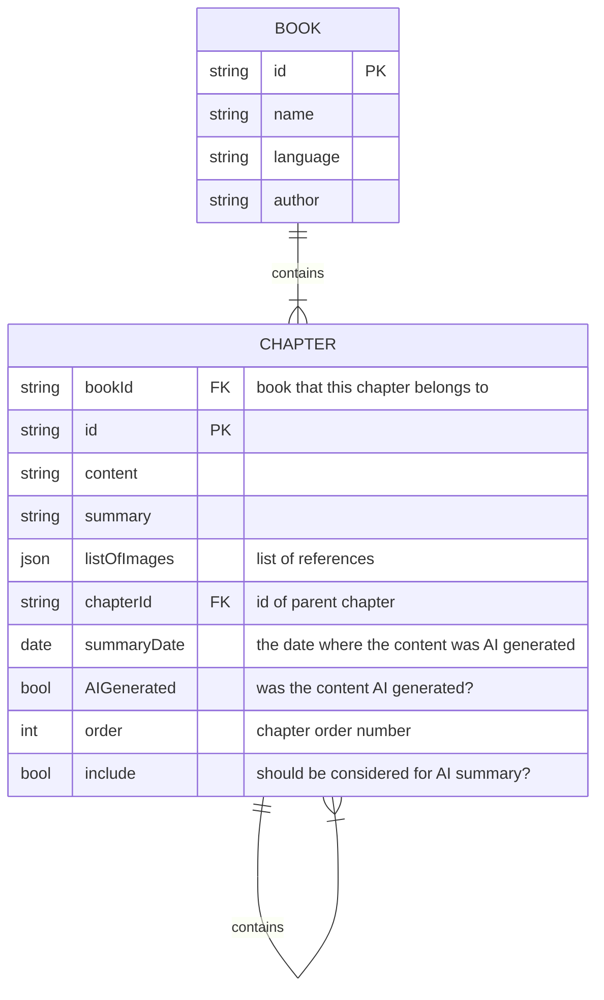

```mermaid
erDiagram
    BOOK {
        string id PK
        string name
        string language
        string author
    }
    CHAPTER {
        string bookId FK "book that this chapter belongs to"
        string id PK
        string content
        string summary
        json listOfImages "list of references"
        string chapterId FK "id of parent chapter"
        date summaryDate "the date where the content was AI generated"
        bool AIGenerated "was the content AI generated?"
        int order "chapter order number"
        bool include "should be considered for AI summary?"
    }
    BOOK ||--|{ CHAPTER : contains
    CHAPTER ||--|{ CHAPTER : contains

```