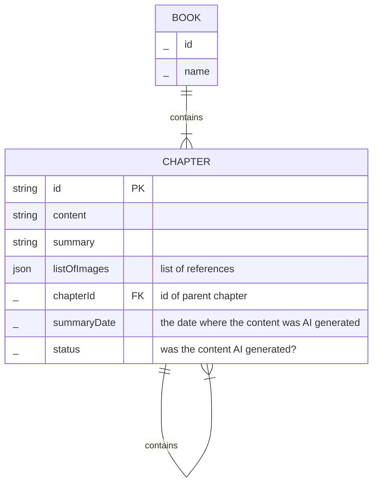

```mermaid
erDiagram
    BOOK {
        _ id
        _ name
    }
    CHAPTER {
        string id PK
        string content
        string summary
        json listOfImages "list of references"
        _ chapterId FK "id of parent chapter"
        _ summaryDate "the date where the content was AI generated"
        _ status "was the content AI generated?"
    }
    BOOK ||--|{ CHAPTER : contains
    CHAPTER ||--|{ CHAPTER : contains

```